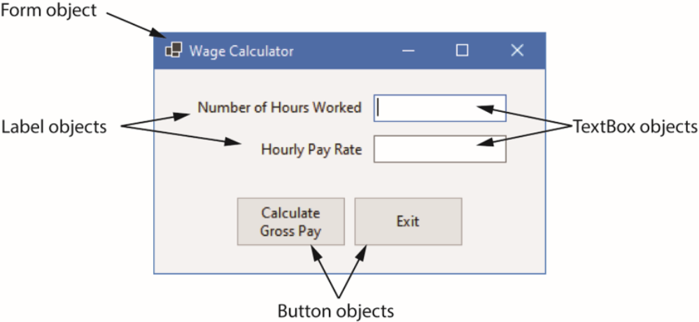
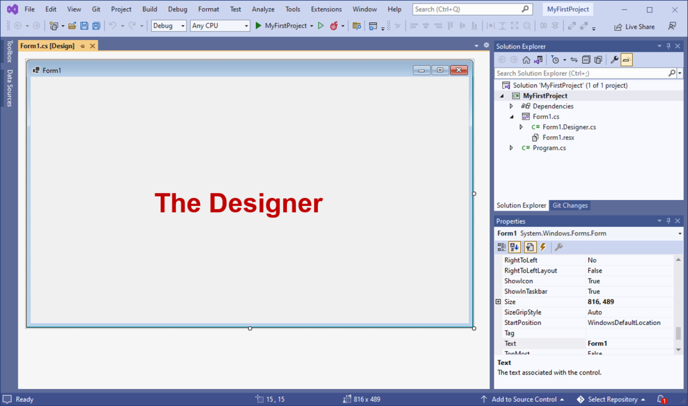
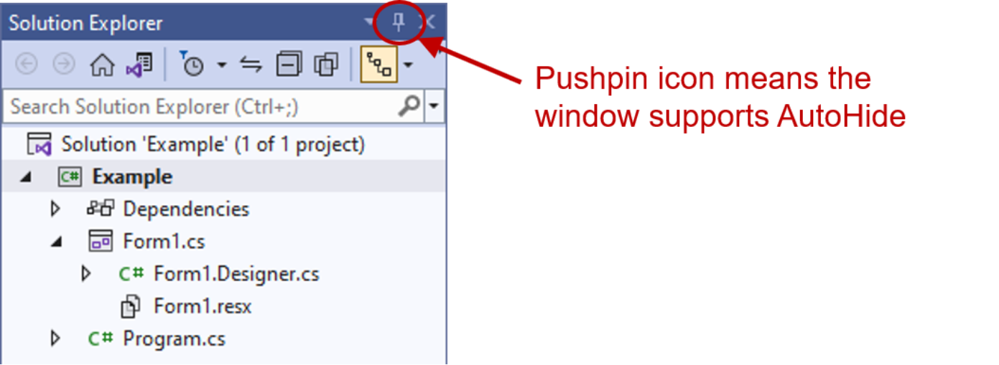
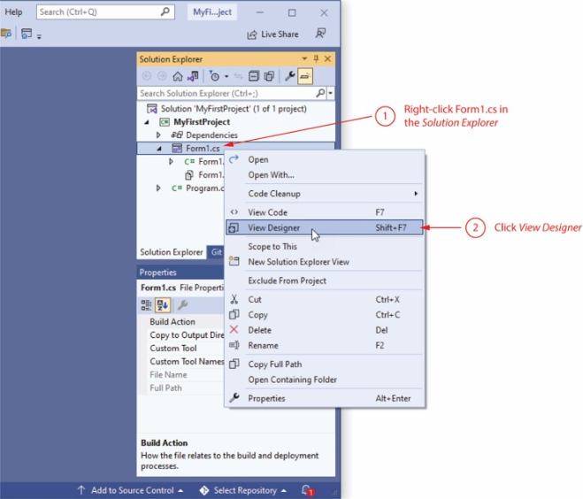
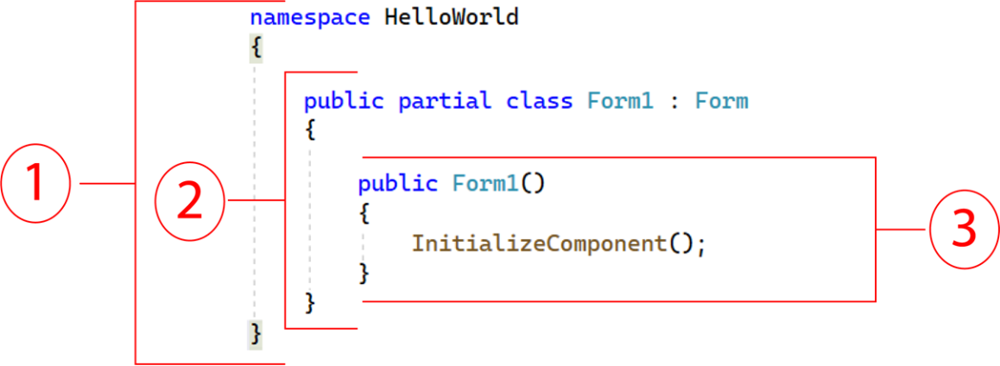

#CHAPTER ONE

#OBJECTIVES
Topics
1.1 Objects
1.2 The Program Development Process
1.8 Getting Started with Visual Studio
2.1 Getting Started with Forms and Controls
2.2 Creating the G U I for Your First Visual C# Application
2.3 Introduction to C# code
2.4 Writing Code for the Hello World Application
2.5 Label Controls
2.6 Making Sense of IntelliSense
2.7 PictureBox Controls
2.8 Comments, Blank Lines, and Indentation
2.9 Writing the Code to Close an Application’s Form
2.10 Dealing with Syntax Errors

#OBJECT
An object is a program component that contains data and performs operations, Programs use objects to perform specific tasks.
Most programming languages use object-oriented programming in which a program component is called an “object”
Program objects have properties (or fields) and methods

-Properties – data stored in an object
-Methods – the operations an object can perform.

#Controls
Objects that are visible in a program G U I are known as controls
Commonly used controls are Labels, Buttons, and TextBoxes
They enhance the functionality of your programs
There are invisible objects in a G U I such as Timers, and OpenFileDialog
A class is code that describes a particular type of object

#.NET Framework
-.NET is a collection of classes and other code that can be used to create programs for Windows operating system

#1.2 Getting Started with Visual Studio
Visual Studio is a professional integrated development environment (I D E)
The Visual Studio Environment includes:
Designer Window
Solution Explorer Window
Properties Window

#1.3 Getting Started with Visual Studio

-Auto Hide allows a window to display only as a tab of the edges

-Toolbox is a window for selecting controls to use in an application.
#The Toolbox
Toolbox is a window for selecting controls to use in an application
Divided into sections such as “All Windows Forms” and “Common Controls”
#Tooltips
A Tooltip is a small box that pops up when you hover the mouse pointer over an item on the toolbar or toolbox.
#Docked and Floating Windows
When a window such as Solution Explorer is docked, it is attached to one of the edges of the Visual Studio environment
When a window is floating, you can click and drag it around the screen
-A window cannot float if it is in Auto Hide mode
Right click a window’s title bar and select Float or Dock to change between them

#Displaying the Designer
Sometimes when you open an existing project, the project’s form will not be automatically displayed in the Designer
You should:
Right click Form1.c s in the Solution Explorer
Click View Designer in the pop-up menu

#A form in Designer is enclosed with thin dotted lines called the bounding box

#The Properties Window
The appearance and other characteristics of a G U I object are determined by the object's properties
Properties are settings that control how the object looks and behaves
The Properties window lists all properties
-Each property has 2 columns:
Left: property’s name
Right: property’s value

#Changing a Property’s Value
Select an object, such as the Form, by clicking it once
If the Properties panel is not already visible, go to the View menu → Properties Window.
Find the property’s name in the list and change its value.
The Text property determines the text to be displayed in the form’s title bar
Example: Change the value from “Form1” to “My First Program”

#Adding Controls to a Form
-In the Toolbox, select the Control (e.g. a Button), then you can either:
double click the Button control
click and drag the Button control to the form
On the form, you can
resize the control using its bounding box and sizing handles
move the control’s position by dragging it
change its properties in the Properties window

#Deleting a Control
Deleting a control is simple: you select it and then press the  Deletekey on the keyboard.

#Rules for Naming Controls
-Controls’ are identified by their names in code
Control names are also known as identifiers.
The naming rules are:
The first character must be a letter (lower or uppercase, does not matter) or an underscore (_)
All other characters can be alphanumerical characters or underscores
The name cannot contain spaces
Examples of valid names are:
showDayButton
DisplayTotal
_ScoreLabel

#2.3 Introduction to c sharp  Code
C# code is primarily organized in three ways: namespaces, classes, and methods
Namespace: a container that holds classes
Class: a container that holds methods
Method: a group of one or more programming statements that perform some operations
A file that contains program code is called a source code file

#Source Code in the Solution Explorer
Each time a new project is created the following two source code files are automatically created:
Program.c s file: contains the application’s start-up code to be executed when the application runs
Form1.c s contains code that is associated with the Form1 form

#A sample of Form1.c s:
The user-defined namespace of the project
Class declaration
A method

#Adding Your Code
G U I applications are event-driven which means they respond to events that occur while the application is running
This means the program waits for the user to do something (like clicking a button, typing, or moving the mouse) and then responds.
An event is a user’s action such as mouse clicking, key pressing, Moving  
In the Designer, double clicking a control such as Button will link the control to a default Event Handler
An event handler is a method that executes when a specific event takes place
A code segment similar to the following will be created automatically:

#Message Boxes
A message box (a k a dialog box) displays a message
.NET provides a method named MessageBox.Show
The method displays a window with a message. A sample code is (bold line):
-Placing it in the myButton_Click event handler can display the string in the message box when the button is clicked

#2.4 Writing Code for the Hello World Application

#2.5 Label Controls
A Label control displays text on a form and can be used to display unchanging text or program output
Commonly used properties are:
Text: gets(read) or sets(write/change) the text associated with Label control
Name: gets or sets the name of Label control
Font: allows you to set the font, font style, and font size
BorderStyle: allows you to display a border around the control’s text
AutoSize: controls the way they can be resized
TextAlign: set the text alignments

#Handling Text Alignments
The TextAlign property supports the following values:

You can select them by clicking the down-arrow button of the TextAlign property

#Using Code to Display Output in a Label Control
By adding the following bold line to a Button's event handler, a Label control can display output of the application.

Notice that
the equal sign (=) is known as assignment operator
the item receiving the value must be on the left of the = operator
the Text property accepts a string only
if you need to clear the text of a Label, simply assign an empty string ("") to clear the Text property 
                answerLabel.Text = "";

#2.6 Making Sense of IntelliSense
IntelliSense provides automatic code completion as you write programming statements
IntelliSense is a smart code completion feature. As you type in your code, it automatically suggests possible keywords, variables, methods, classes, or properties that you might want to use.
It provides an array of options that make language references easily accessible

With it, you can find the information you need, and insert language elements directly into your code.

#2.7 PictureBox Controls
-A PictureBox control displays a graphic image on a form
Commonly used properties are:
Image: specifies the image that it will display
SizeMode: specifies how the control’s image is to be displayed
Visible: determines whether the control is visible on the form at run time

#Creating Clickable Images
You can double click the PictureBox control in the Designer to create a Click event handler and then add your codes to it. For example,

#Sequential Execution of Statements
Programmers need to carefully arrange the sequence of statements in order to generate the correct results
In the following example, the statements in the method execute in the order that they appear:

#This makes sense because when you click the button, you want to flip the card: back is visible, face is hidden.

What happens here? First line hides the face second line also hides the back. Result: Both pictures are hidden. 

Incorrect arrangement of sequence can cause logic errors

#2.8 Comments, Blank Links, and Indentation
Comments are brief notes that are placed in a program’s source code to explain how parts of the program work
A line comment appears on one line in a program.
A block comment can occupy multiple consecutive lines in a program

#Using Blank Lines and Indentation
Programmers frequently use blank lines and indentation in their codes to make the code more human-readable
Compare the following two identical codes:
namespace Wage_Calculator
{
public partial class Form1 : Form
{
public Form1()
{
lnitializeComponent();
}

private void exitButton_Click(object sender, EventArgs e)
{
// Close the form.
this.Close();
}
}
}

#2.9 Writing the Code to Close an Application’s Form
To close an application’s form in code, use the following statement:
- this.Close();
Application.Exit;

#2.10 Dealing with Syntax Errors
The Visual Studio code editor examines each statement as you type it and reports any syntax errors that are found
If a syntax error is found, it is underlined with a jagged line
If a syntax error exists and you attempt to compile and execute, you will see the following window

