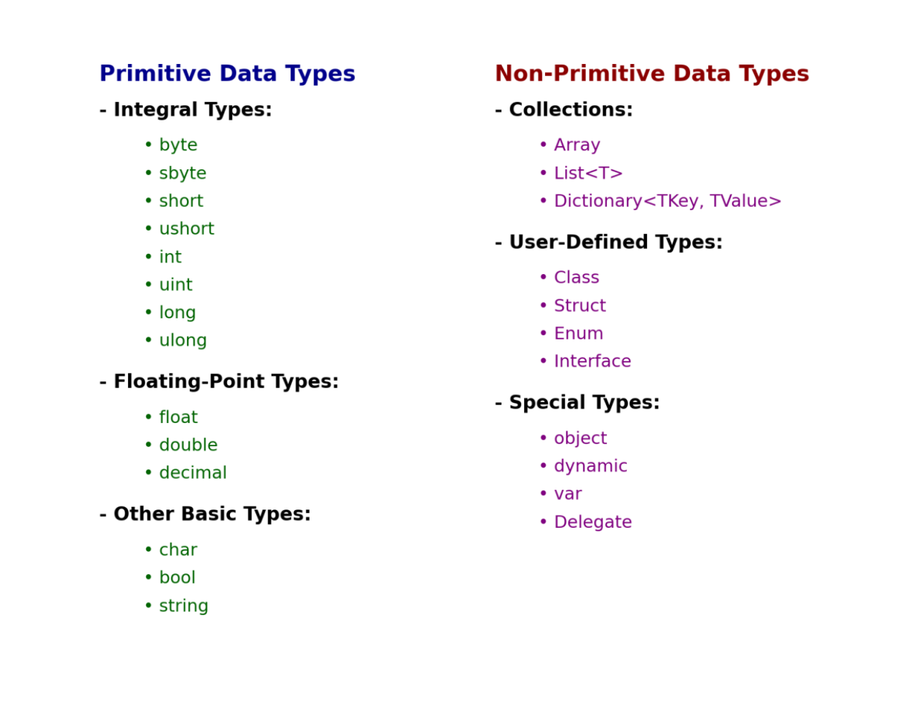
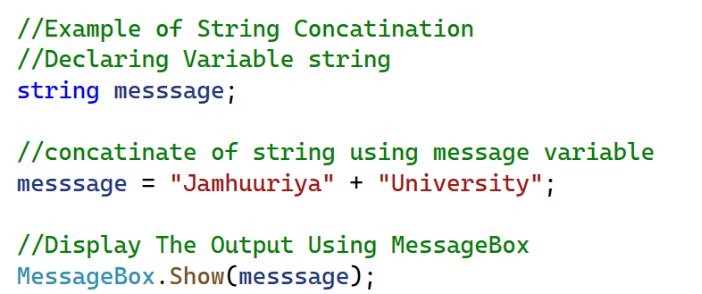

CHAPTER 2:Topics

#OBJECTIVES

3.1 Reading Input with TextBox Controls
3.2 A First Look at Variables
3.3 Numeric Data Type and Variables
3.4 Performing Calculations
3.5 Inputting and Outputting Numeric Values
3.6 Formatting Numbers with the ToString Method
3.7 Simple Exception Handling
3.8 Using Named Constants
3.9 Declaring Variables as Fields
3.10 Using the Math Class
3.11 More G U I Details
3.12 Using the Debugger to Locate Logic Errors

#TextBox control
-a rectangular area
-can accept keyboard input from the user
-located in the Common Control group of the Toolbox
-double click to add it to the form
-default name is textBoxn.

#The Text Property
A TextBox control’s Text property stores the user inputs
Text property accepts only string values, e.g.
   textBox1.Text = "Hello";
To clear the content of a TextBox control, assign an empty string("")
-textBox1.Text = "";
-textBox1.Text = string.Empty;
-textBox1.Clear();

#3.2 A First Look at Variables
A variable is a storage location in memory
A variable name represents the memory location
     DataType VariableName;
#Datatype
A C# variable must be declared with a proper data type
The data type specifies the type of data a variable can hold
many data types are known as primitive data types
-they store fundamental types of data means essential or core
such as strings and integers

-“Primitive” means basic / simple / built-in.
In C#, primitive data types are already defined by the language, not created by you.

#Variable Names
A variable name identifies a variable
Always choose a meaningful name for variables
Basic naming conventions are:
the first character must be a letter (upper or lowercase) or an underscore (_)
the name cannot contain spaces

do not use C# keywords or reserved words.

#String Variables
A string is a combination of characters 
A variable of the string data type can hold any combination of characters, such as names, phone numbers, and social security numbers
The value of a string variable is assigned on the right of the = operator surrounded by a pair of double quotes:
productDescription = "Jamhuuriya University";

The following assigns the productDescription string to a Label control named productLabel:
productLabel = productDescription;
You can also display a string variable in a Message Box:
MessageBox.Show(productDescription);

#String Concatenation
Concatenation is the appending of one string to the end of another string

Concatenation can happen between a string and another data type
int and string
double and string

#Local Variables and Scope
-A local variable belongs to the method in which it was declared
Only statements inside that method can access the variable
Scope describes the part of a program in which a variable may be accessed
Lifetime of a variable is the time period during which the variable exists in memory while the program is executing
A local variable is created in memory when the method in which it is declared starts executing. When the method ends, all the method’s local variables are destroyed.

#Duplicate Variable Names
You cannot declare two variables with the same name in the same scope. 
For example, if you declare a variable named productDescription in an event handler, you cannot declare another variable with that name in the same event handler. 
You can, however, have variables of the same name declared in different methods

#Assignment Compatibility 
-You can assign a value to a variable only if the value is compatible with the variable’s data type.
 Only strings are compatible with the string data type
 
 
 #Initializing Variables
 In C#, a variable must be assigned a value before it can be used. For example.

 This code declares a string variable named productDescription and then tries to display the variable’s value in a message box. 
The only problem is that we have not assigned a value to the variable. When we compile the application containing this code, we will get an error message such as Use of unassigned local variable ‘productDescription’. 
The C# compiler will not compile code that tries to use an unassigned variable.

#Declaring Multiple Variables with One Statement
You can declare multiple variables of the same data type with one declaration statement. Here is an example:
string lastName, firstName, middleName;

Remember, you can break up a long statement, so it spreads across two or more lines. Sometimes you will see long variable declarations written across multiple lines, like this:
string lastName = "Khalaf",
       firstName = "Mohamed",
       middleName = "Abdullahi";

#3.3 Numeric Data Types and Variables
If you need to store a number in a variable and use the number in a mathematical operation, the variable must be of a numeric data typ

#Assignment Compatibility for decimal Variables
You can assign either decimal or int values to decimal variables, but you cannot assign double values to decimal variables. For example,
decimal balance = 9280.73m;  // This works
decimal price = 50;          // This works
decimal sales = 6500.0;      // ERROR!

#Explicit Conversion with Cast Operators
You can use the cast operator which is simply the name of the type enclosed in parentheses
int wholeNumber;
decimal moneyNumber = 4500m;
wholeNumber = (int)moneyNumber;
-double realNumber;
decimal moneyNumber = 625.70m;
realNumber = (double)moneyNumber;

#Declaring Local Variables with the var Keyword
var is a keyword you can use instead of writing the full type of a variable.
-The compiler automatically figures out the type from the value you assign
-You can use the var keyword to declare and initialize a local variable. 
You must provide an initialization value when declaring a variable with var.
The compiler determines the variable's data type from the initialization value.
The var keyword can be used only to declare local variables (variables declared inside a method).
Later you will see how var can simplify complex declarations

#3.9 Declaring Variables as Fields

A field is a variable that is declared at the class level
It is declared inside the class, but not inside of any method
A field’s scope is the entire class
In the following FieldDemo application, the name variable is a field that is declared in the Form1 class
The name field is created in memory when the Form1 form is created

#3.10 Using the Math Class
The .NET Math class provides several methods for performing complex mathematical calculations
Math.Sqrt(x): returns the square root of x (a double).
Math.Pow(x, y): returns the value of x raised to the power of y. Both x and y are double.
Math.Max(x, y): Returns the greater of the two values x and y
Math.Min(x, y):Returns the lesser of the two values x and y.
Math.Round(x) :Returns the value of x (a double or a decimal) rounded to the nearest integer.
There are two predefined constants:
Math.PI: represents the ratio of the circumference of a circle to its diameter.
Math.E: represents the natural logarithmic base

#3.11 More G U I Details – Tab Order
When an application is running, one of the form’s controls always has the focus
Focus means a control receives the user’s keyboard input
When a button has the focus, pressing the Enter key can execute the button’s Click event handler
The order in which controls receive the focus is called the tab order
When the user presses the tab key to select controls, the program will follow the tab order
The TabIndex property contains a numeric value indicating the control’s position in the tab order
The value starts with 0. The index of first control is 0, the nth

#Tab Order
To set the tab order of a control, click Tab Order on the View menu. This activates the tab-order selection mode on the form.
Simply click the controls with the mouse in the order you want.
Notice that Label controls do not accept input from the keyboard. They cannot receive focus.
Their TabIndex values are irrelevant

#Assign Keyboard Access Key to Buttons
An access key (or mnemonic) is a key that is pressed in combination with the Alt key to quickly access a control
You can assign an access key to a button’s Text property by adding

#Setting Colors
Forms and most controls have a BackColor property
Controls that can display Text also have a ForeColor property
These color-related properties support a drop-down list of colors
The list has tree tabs: 
Custom: display a color palette
Web: list colors displayed with consistency in Web browsers
System: list colors defined in current Windows
You can set colors in color
The .NET Framework provides numerous values that represent colors
messageLabel.BackColor = Color.Black;
messageLabel.ForeColor = Color.Yellow;

#Background Images for Forms
A Form has a property named BackgroundImage that is similar to the Image property of a PictureBox.
Simply import an image to the Select Resource window
A Form also has a BackgroundImageLayout property that is similar to the SizeMode property of a PictureBox.
Choose from one of the following options

#GroupBoxes versus Panels
A GroupBox control is a container with a thin border and an optional title that can hold other controls
A Panel control is also a container that can hold other controls
There are several primary differences between a Panel and GroupBox:
A panel cannot display a title and does not have a Text property, but a GroupBox supports these two properties.
A panel’s border can be specified by its BorderStyle property, while the GroupBox cannot be

#3.12 Using the Debugger to Locate Logic Errors
A logic error is a mistake that does not prevent an application from running, but causes the application to produce incorrect results.
Mathematical errors
Assigning a value to the wrong variable
Assigning the wrong value to a variable
etc.
Finding and fixing a logic error usually requires a bit of detective work.
Visual Studio provides debugging tools that make locating logic errors easier.

#Breakpoints
A breakpoint is a line you select in your source code.
When the application is running and it reaches a breakpoint, the application pauses and enters break mode.
While the application is paused, you may examine variable contents and the values stored in certain control properties.

#Break Mode
In Break mode, to examine the contents of a variable or control property, hover the cursor over the variable or the property's name in the Code editor.

#The Locals and Watch Windows
The Locals window displays a list of all the variables in the current procedure. The current value and the data type of each variable are also displayed.
The Watch window allows you to add the names of variables you want to watch. This window displays only the variables you have added. Visual Studio lets you open multiple Watch windows.
You can open any of these windows by clicking Debug on the menu bar, then selecting Windows, and then selecting the window that you want to open.

#Single-Stepping
Visual Studio allows you to single-step through an application’s code once its execution has been paused by a breakpoint.
This means that the application's statements execute one at a time, under your control.
After each statement executes, you can examine variable and property values.
This process allows you to identify the line or lines of code causing the error.
To single-step, do any of the following:
Press F11 on the keyboard, or
Click the Step Into command on the toolbar, or
Click Debug on the menu bar, and then select Step Into from the Debug menu

 
